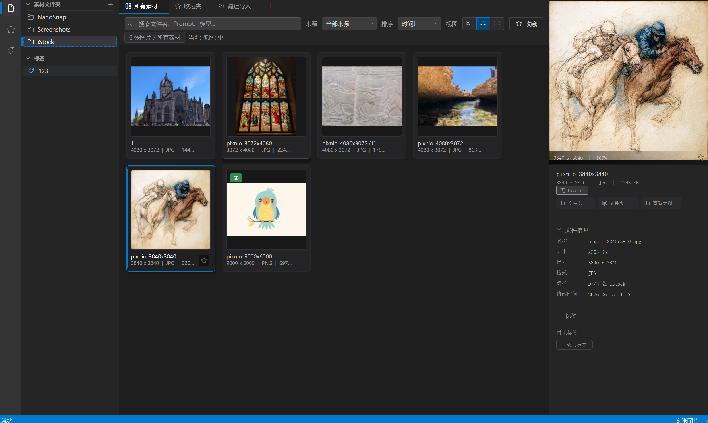

# PixoBook — AI 素材库 (AI Material Library)

A desktop application for managing, browsing, searching, and organizing AI-generated image assets. Built with **Qt 5** and **C++17**.



## Features

- **Smart import** — Scan directories for images; automatic duplicate detection via SHA-256 hashing
- **AI metadata parsing** — Automatically detects source tool and extracts generation parameters:
  - **Stable Diffusion** — Parses prompt, negative prompt, seed, steps, CFG scale, model, sampler from PNG `tEXt`/`zTXt` chunks
  - **Midjourney** — Extracts seed and model name from filename patterns
  - **DALL-E** — Extracts prompt from filename patterns
- **Database** — SQLite-backed storage with tags, favorites, full-text search, and metadata querying
- **Image gallery** — Grid-based thumbnail view with lazy loading, keyboard navigation, multi-select, and drag-and-drop import
- **Lightbox viewer** — Full-screen image viewer with zoom/pan and navigation
- **Detail panel** — Slide-out panel showing full image preview, metadata, and tag management
- **File watching** — Real-time monitoring of watched folders for new or removed files
- **Custom dark theme** — Fully custom-painted UI with VS Code Codicon icon font
- **Command palette** — `Ctrl+Shift+P` quick action menu
- **Tag system** — Color-coded tags with filtering

## Build

### Prerequisites

- **Qt 5** (Widgets, Sql, Concurrent, Test)
- **CMake** 3.16+
- **C++17** compiler (MSVC recommended on Windows)

### Build steps

```bash
mkdir build
cd build
cmake ..
cmake --build .
```

### Run tests

```bash
cd build
ctest
```

## Project structure

```
PixoBook/
├── CMakeLists.txt          # Build configuration
├── resources/              # Qt resources (fonts, QRC)
├── src/
│   ├── main.cpp            # Application entry point
│   ├── core/               # Interfaces and utilities
│   ├── database/           # SQLite database layer
│   ├── models/             # Data structures (Asset, Metadata, Tag)
│   ├── parsers/            # AI metadata parsers (SD/MJ/DALL-E)
│   ├── services/           # Business logic (scanner, cache, watcher, controller)
│   └── ui/                 # Qt widgets and custom-painted UI
├── tests/                  # Qt Test unit tests
└── docs/                   # Development documentation
```

## License

Proprietary — all rights reserved.
